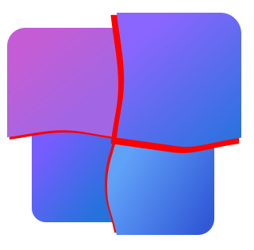

    

<h1 align="center">Windows 12 网页版</h1>

  
  
  
  </a>
  

  <a href="README_en_us.md">English</a> | 
  <b>简体中文</b> | 
  <a href="README_fr_fr.md">Français</a>

  
Star History

  

## 公告
### 重要！
无偿恳请各位有能力的用户为我们制作宣传片！
详情请见[宣传片公告](https://github.com/tjy-gitnub/win12/wiki/%E5%AE%A3%E4%BC%A0%E7%89%87%E5%85%AC%E5%91%8A)

---

- [Windows 12 网页版](#windows-12-网页版)
  - [前前言](#前前言)
  - [前言](#前言)
    - [特别感谢](#特别感谢)
  - [效果展示](#效果展示)
  - [在线体验](#在线体验)
  - [安装和使用](#安装和使用)
  - [前景规划](#前景规划)
  - [开源说明](#开源说明)
  - [贡献须知](#贡献须知)

## 前前言

最近（不久之前）看到有一些冒充我们的，在此做个声明：

我们项目是由 tjy-gitnub（初三），NB-group（预备），782（初一），三位开发者共同开发的！

（如果你要为我们制作宣传视频，也请顺带把我们的b站账号挂一下

我们只在 GitHub、Bilibili 和爱发电上有官方账号！

GitHub：

去贡献者里看一下吧~

Bilibili：

tjy-gitnub：

NB-group：

782：

爱发电：

全世界唯一可以捐款的官方账号！擦亮你的双眼！不要给其他人捐款！

链接：<https://afdian.com/a/qstudio>

**我们的项目及源代码绝对不进行强制收费！如果看到售卖本项目且没有注明原项目链接的，或违反EPL-2.0开源协议及本项目开源说明的，欢迎举报！**

## 前言

最近（很久以前）看到 Windows 12 概念版（Powered by PowerPoint）后深受启发，决定做一个 Windows 12 网页版，就像 [Windows 11 网页版](https://win11.blueedge.me/) 一样。

参考 [前景规划](#前景规划)。

精美的 ui 设计，流畅丰富的动画，各种高级的功能（相较于网页版）。

> 移动端适配不太完善，开桌面版网站凑合着用吧 `>v-)o`

### 特别感谢

特别感谢以下赞助者:

- CursoR_光标（<https://afdian.com/a/cursor>）
- Baymax（<https://afdian.com/u/a131cd504dea11eeb6be5254001e7c00>）

在此对以上赞助者表示公开鸣谢！

## 效果展示

> 新的版本有很多变化，仅供参考，请以实物为准（你点一下 [这里](https://tjy-gitnub.github.io/win12/desktop.html) 就知道了啊，不麻烦`-_-)o` ）

*开始菜单*

*丰富的应用*

*深色模式*

*AI Copilot*

## 在线体验

[在线预览](https://tjy-gitnub.github.io/win12/desktop.html)

有点慢，稍等一下~

## 安装和使用

下载代码，无需安装，打开 desktop.html 即可。

## 前景规划

关于该项目的路径规划:

- [x] 基本功能与应用
- [x] 外观整体优化
- [x] 加入特效
- [x] 窗口功能
- [x] 应用完善
- [x] 添加更多个性化方面的设置
- [x] 添加 Edge 应用
- [ ] 为更多应用添加标签页
- [x] 完善小组件，添加到桌面等功能
- [x] 动态壁纸
- [ ] 更多任务栏的自定义
- [ ] 丰富应用生态，添加 Microsoft Store
- [ ] 完善设置及 Windows 更新

下面是一些...呃......畅..想 `~o~)/`：

- [x] 建立文件系统
- [ ] 建立自己的可执行文件机制
- [ ] 将 .exe 文件转化并执行
- [ ] 提供更多 api 供应用调用
- [x] 内置浏览器内核，成为应用
- [ ] 将项目更名为 "Windows 12"
- [ ] 封装到 Windows 系统中
- [ ] 将启动程序设为此应用
- [ ] 去除多余系统功能，封装成独立的操作系统
- [ ] 将项目更名为 "Doswin 1.0"
- [ ] 适配量子计算机
- [x] 接入ChatGPT
- [ ] 将项目更名为 "550W"

## 开源说明

本项目作者：谭景元（tjy-gitnub）

本项目链接：<https://github.com/tjy-gitnub/win12>

此项目是一个开源项目。此项目使用 EPL v2.0 开源许可。开源许可是具有法律效力的合同，请自觉遵守开源许可，尊重他人劳动。

根据许可，你可以对该项目进行传播、分发、修改以及二次发布，包括个人和商业用途，但我方不鼓励一切商业用途。

您必须给出源码来源，**包括作者，项目链接**（见上）等，必须使用相同的协议开源。

若此项目的源码作为项目的一部分与你私有的源码一起发布时，你可以使用其它协议，**但要声明 EPL 部分的内容并声明此部分继续遵循 EPL 协议**。

不是在该项目基础上进行增加、修改的，仅参考源码的，不需要开源，但也仅供学习用途。

由于近期发现大量滥用行为，在此规定附加条例：

- 任何使用本项目者，必须在介绍里附上原作者及项目链接，不得故意隐瞒原项目中的署名信息、原作者或项目链接，不得限制查看原项目中的署名信息、原作者或项目链接，且不得修改原项目中的署名信息；

- 将本项目用于商业用途者，需要**标明原作者及项目链接**，且**必须**以 EPL 协议开源。未经修改的源代码**不得用于**商业用途；

- 任何使用本项目者，不得移除或故意隐藏、限制查看本声明；

- 请您遵守上述规定，我方有权通过法律手段进行合法维权。

## 贡献须知

详情请见 [贡献指南](./CONTRIBUTING.md)。
